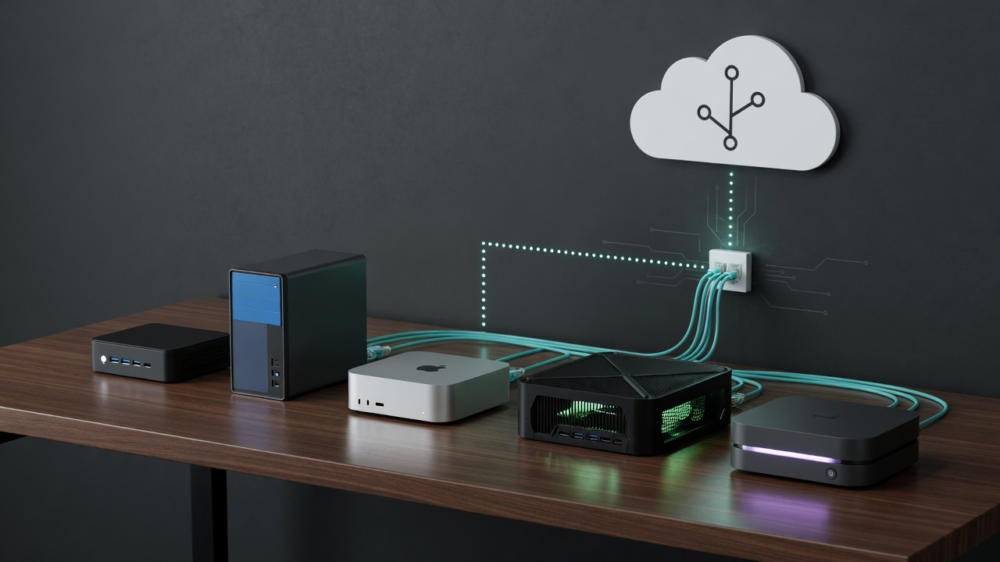
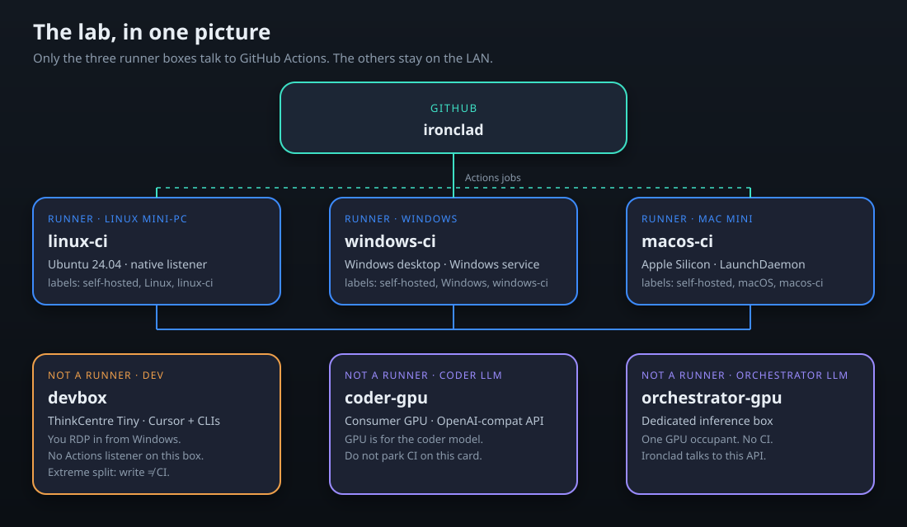
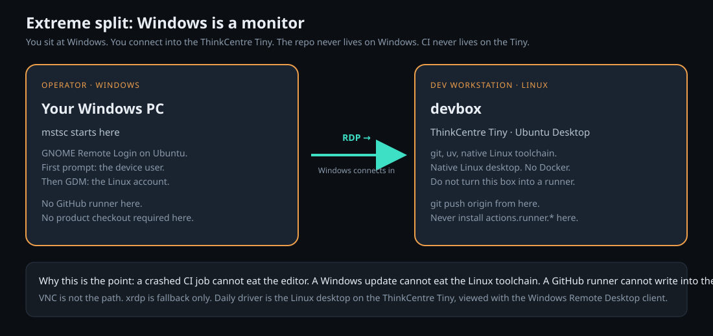
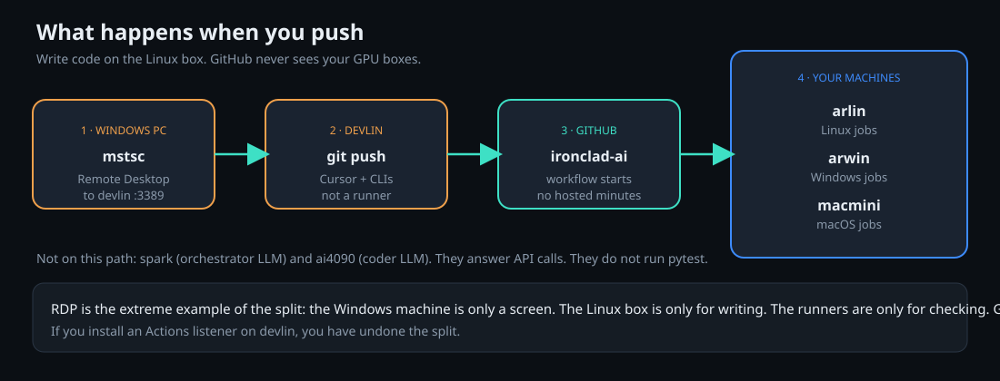
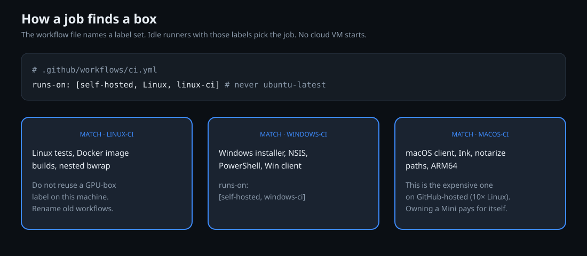

# Self-hosted GitHub CI for Ironclad AI

This is an **example lab**, not a dump of anyone’s real hostnames. The idea: a few small PCs run GitHub Actions for **Ironclad** so you do not buy GitHub-hosted minutes. Public sources will live in the `ironclad` repo. Names below (`devbox`, `linux-ci`, …) are placeholders. Pick your own aliases in `~/.ssh/config`.

No IPs, no SSH keys, no registration tokens live in this tree.



## Why this exists

GitHub Actions on **private** repos burns plan minutes when the job runs on `ubuntu-latest`, `windows-latest`, or `macos-latest`. macOS is billed at ten times Linux. A product with Linux tests, a Windows installer, and a Mac client will empty a Team plan in a busy week.

**Self-hosted runners do not consume those minutes.** You pay electricity and the machines you already own. GitHub is still the forge (git, PRs, checks). The compute stays on your desk.


You still pay GitHub for the usual account (and for artifact storage if you keep huge logs). You do **not** pay per pytest.

## The one-sentence architecture

**Write on a ThinkCentre Tiny running Linux. Watch it from Windows over RDP. Check it on three dedicated runners. Talk to models on GPU boxes that never run CI.**



| Example name | What it is | GitHub Actions? |
|---|---|---|
| **devbox** | Lenovo **ThinkCentre Tiny**, Ubuntu Desktop, native Linux toolchain | **No. Never.** |
| Operator PC | Windows, Remote Desktop client only | No |
| **linux-ci** | Linux mini-PC, native Actions listener | Yes — Linux jobs |
| **windows-ci** | Windows desktop, Windows service | Yes — Windows jobs |
| **macos-ci** | Apple Silicon Mini, LaunchDaemon | Yes — macOS jobs |
| **coder-gpu** | Consumer GPU box, coder LLM (OpenAI-compatible) | No |
| **orchestrator-gpu** | Dedicated inference box, orchestrator LLM | No |

Optional, not this lab: [minimal Docker hardware](https://github.com/GrokBuildMJW/Ironclad-AI-minimal-hardware) if you only *run* Ironclad on one PC, and [cloud coder](https://github.com/GrokBuildMJW/Ironclad-AI-cloud-coder) if the model lives at a vendor instead of a GPU. Local serving pins: [Flash-Next on DGX Spark](https://github.com/GrokBuildMJW/Qwen3.8-Flash-Next-NVFP4-SGLang-DGX-Spark), [27B vLLM](https://github.com/GrokBuildMJW/Qwen3.8-27B-NVFP4-vLLM-DGX-Spark), [Qwen3-Coder on RTX 4090](https://github.com/GrokBuildMJW/Qwen3-Coder-30B-A3B-Q4_K_M-llama.cpp-RTX-4090).

## Extreme split: RDP from Windows onto the ThinkCentre Tiny

This is the part people skip, and the part that keeps you sane.

The Windows machine is **not** where Ironclad lives. It is a keyboard, a screen, and `mstsc`. All writing happens on **devbox**: a **ThinkCentre Tiny** with Ubuntu Desktop, GNOME Remote Login, TCP **3389**, LAN only.



### Do this once on Windows

1. Put a short alias for the ThinkCentre Tiny in `~/.ssh/config` (hostname + key). SSH is for scripts; daily work is RDP.
2. Open **Remote Desktop Connection** (`mstsc`).
3. Computer: that alias (port 3389 is the default).
4. First prompt is the **device** user (Ubuntu Remote Login). Then GDM asks for the Linux account.
5. If the session is a black screen, turn NLA off on that `.rdp` file and try again. Do not install VNC. xrdp is fallback only.

You work **on the ThinkCentre Tiny**, inside that RDP session. Linux is native there — no Docker on the editor box. A Windows update cannot trash the toolchain. A failed CI job cannot lock the files you are typing.

**Do not** install a GitHub Actions listener on the ThinkCentre Tiny. If you do, you have put the editor and the judge on the same disk.

## What happens when you push




1. You are already inside **devbox** via RDP.
2. `git push` to the `ironclad` repo.
3. A workflow starts. It must **not** say `runs-on: ubuntu-latest`.
4. Idle listeners on **linux-ci** / **windows-ci** / **macos-ci** pick the jobs that match their labels.
5. **orchestrator-gpu** and **coder-gpu** do not appear in this story. They serve models.

## How a job finds a box



```yaml
# Linux tests
runs-on: [self-hosted, Linux, linux-ci]

# Windows installer / client
runs-on: [self-hosted, windows-ci]

# macOS client
runs-on: [self-hosted, macOS, macos-ci]
```

Never two listeners with the same runner id (`TaskAgentSessionConflict`). One native process per box.

Do not hang leftover GPU-box labels on the Linux runner “so old workflows still work.” Rename the workflows. The GPU box is not CI.

## How to set this up (the short version)

### 1. Buy (or reuse) three cheap computers

You do not need a cluster. A used Ryzen mini-PC, a spare Windows desktop, and a Mac mini cover Linux, Windows, and macOS. Keep GPU boxes for models. The **ThinkCentre Tiny** is the editor, not a fourth runner.

### 2. Linux runner (`linux-ci`)

- Ubuntu **24.04** with the **6.8** GA kernel. Do not install 26.04 on the runner. Do not copy this mix onto the ThinkCentre Tiny.
- Native systemd listener (`actions.runner.<org>-<repo>.<name>`), not a compose container with `restart=always`.
- Jobs run on the host. The ThinkCentre Tiny already is Linux, so the editor does not need Docker, and this example does not put Docker on `linux-ci` either.

### 3. Windows runner (`windows-ci`)

- Local account. No Entra/Intune.
- Official runner as a **Windows service**. One listener. `RemoteSigned` at LocalMachine so `run:` steps work.

### 4. macOS runner (`macos-ci`)

- System **LaunchDaemon**, not a user LaunchAgent, so it comes up with zero GUI login.
- `KeepAlive` + `RunAtLoad`. Prevent sleep on AC power. Display sleep is fine.
- This is the box that used to destroy GitHub-hosted budgets. Owning it is the whole trick.

### 5. Register against the **ironclad** repo

Create a runner in the GitHub UI for `ironclad`, copy the token to the box, run `config.sh` / `config.cmd` **once**. Do not commit the token. Do not `--replace` unless GitHub says the old id is dead.

### 6. Point every workflow at those labels

Search the repo for `ubuntu-latest`, `windows-latest`, `macos-latest`. Each hit is a bill. Replace with the self-hosted label sets above.

## Rules that keep the bill at zero compute

1. **Runners are not editors.** The ThinkCentre Tiny writes. `linux-ci` / `windows-ci` / `macos-ci` check.
2. **GPUs are not runners.** `orchestrator-gpu` and `coder-gpu` serve LLMs. One GPU occupant each.
3. **Windows is not the workspace.** RDP is a viewport. The tree lives on the ThinkCentre Tiny.
4. **No IPs in the `ironclad` repo.** Aliases in SSH config. A naming-gate CI job can fail a PR that pastes a LAN address.
5. **One listener per machine.** Native systemd / Windows service / LaunchDaemon.
6. **Hosted labels are a regression.** `ubuntu-latest` is how you go broke again.

## What this is not

- Not a dump of a real LAN. Example names only.
- Not a SaaS. Not a Terraform module.
- Not permission to install an Actions listener on the **ThinkCentre Tiny**.
- Not a weight mirror. Model pins live in the sibling Spark / 4090 recipe repos.
- Not a promise that GitHub is free. Seats, LFS, and artifact storage still exist. **Job minutes** are what this lab removes.

## License

MIT for the notes and diagrams in this tree.
